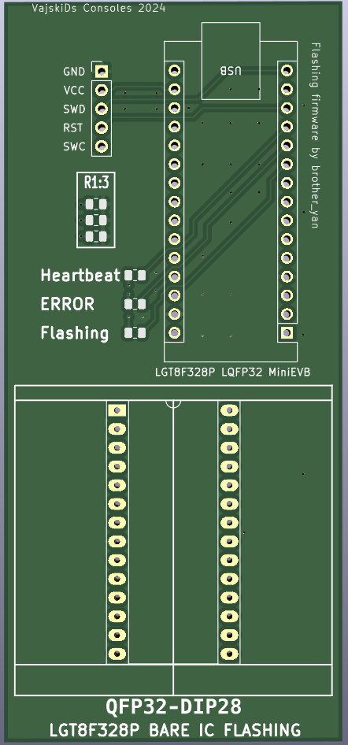

  

  

Uses: https://github.com/brother-yan/LGTISP 

I have been using brother yans firmware for flashing UberNee SubQ monitoring 100% stealth PS1 modchips, only difference is uncommenting the LED
lines, adding or modifying one line of code (it's outlined in UberNee install guide) and the fact I use another LGT8F328P for the flashing.
I also use a specific library, outlined in the Ubernee guide as well. I received some bare IC's a while ago and realised I couldn't even flash them, so came V2. 
I used the reference pinouts (pictured) and a multimeter on the adapter to confirm which pins went where.

V1: Flashes dev/ prototyping boards only
V2: Fit QFP32 to DIP28 adapters to flash bare LGT8F328P IC's
